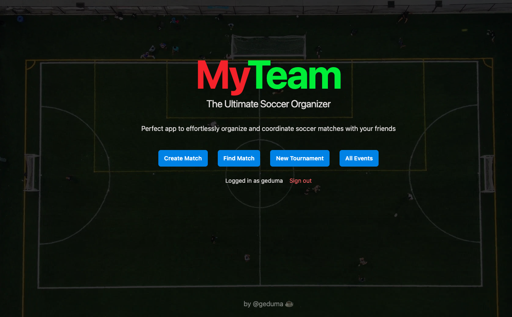
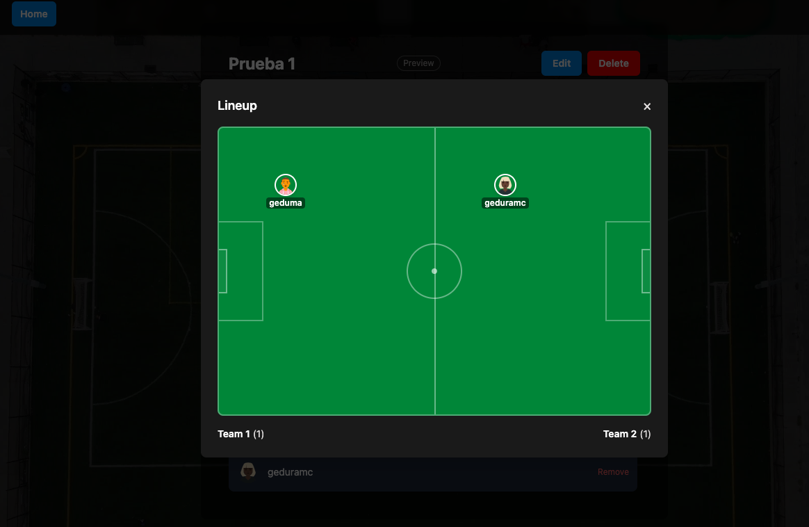
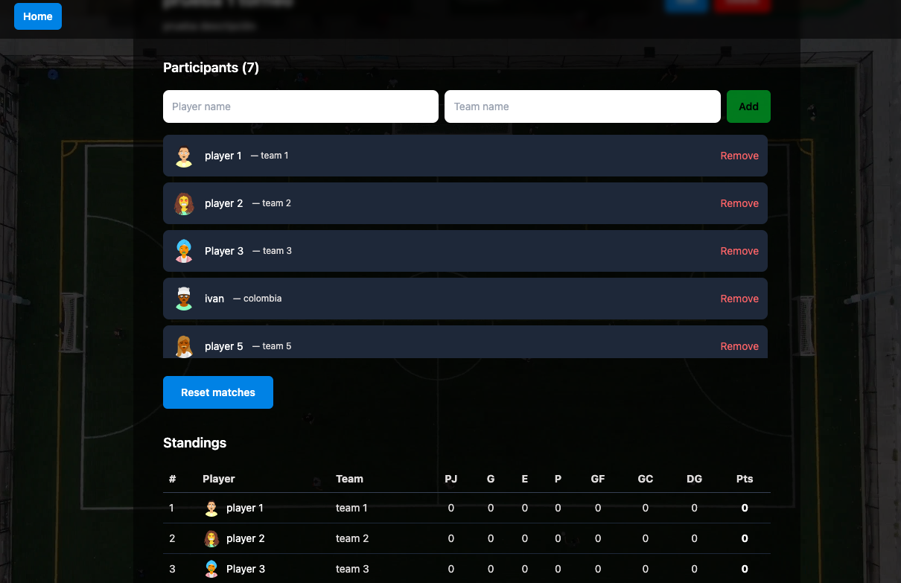

<h1 align="center">MyTeam</h1>
<p align="center"><p>
<p align="center">The Ultimate Soccer Organizer<p>

<p align="center">
  
  
  
  
  
  
</p>

Create soccer matches and round-robin tournaments with your friends. Share invite links, shuffle teams, and manage everything from your phone.

## Features

- **Guest mode** — no login required to find and join events
- **Google sign-in** — only needed to create events and tournaments
- **Create matches** — title, date, time, location, description
- **Join via invite link** — unique hash per event, open to all
- **Visual soccer field** — see players positioned on a realistic field
- **Auto shuffle** — randomly divide players into two teams
- **Manual swap** — drag or click players to move between teams
- **Round-robin tournaments** — standings, match generation, score tracking
- **All Events** — public list of matches & tournaments (no auth needed)
- **Public preview** — read-only routes to share event details
- **Superuser** — special user who can manage any event, even expired
- **Auto-expiration** — events expire after 15 days (non-superusers can't join or edit)
- **Renew** — superuser can reactivate expired events with one click
- **DiceBear avatars** — unique avatars for every user
- **Mobile responsive** — works on any device

## Tech Stack

| Layer | Technology |
|-------|-----------|
| Frontend | Vue 3 (Composition API, `<script setup>`) |
| Build | Vite 7 |
| Styling | Tailwind CSS 3 |
| Routing | Vue Router 4 (history mode) |
| Auth | Geduma Auth API (OAuth centralizado) · Guest mode (UUID local) |
| Database | Supabase (PostgreSQL) |
| Avatars | DiceBear HTTP API |
| Linting | StandardJS |

## Quick Start

```bash
git clone https://github.com/geduma/my-team.git
cd my-team
nvm use            # uses Node v18.18.0
npm install
cp .env.example .env   # fill in your credentials
npm run dev
```

### Environment Variables

```env
VITE_APP_ID=app_xxxxxx
VITE_SUPABASE_URL=https://your-project.supabase.co
VITE_SUPABASE_ANON_KEY=your-anon-key
```

## Available Commands

| Command | Description |
|---------|-------------|
| `npm run dev` | Development server (Vite) |
| `npm run build` | Production build |
| `npm run preview` | Preview production build |
| `npm run test` | Run tests (Vitest) |
| `npm run test:watch` | Tests in watch mode |
| `npx standard` | Lint with StandardJS |

## Routes

| Path | Required auth | Description |
|------|:------------:|-------------|
| `/` | No | Landing page |
| `/create` | Google | Create a match |
| `/join/:hash` | No* | Join via invite link (guest: enter name) |
| `/match/:id` | No* | Match details & join (guest: view & join) |
| `/preview/match/:id` | No | Public read-only match view |
| `/tournament` | Google | Create a tournament |
| `/tournament/:id` | No* | Tournament details (guest: read-only) |
| `/preview/tournament/:id` | No | Public read-only tournament view |
| `/events` | No | Public list of all events |
| `/auth/callback` | No | OAuth callback |

_* Guest users get an auto-generated UUID identity stored in IndexedDB._

## Screenshots





<p align="center" style="margin-top: 4rem;">by @geduma ☕</p>
